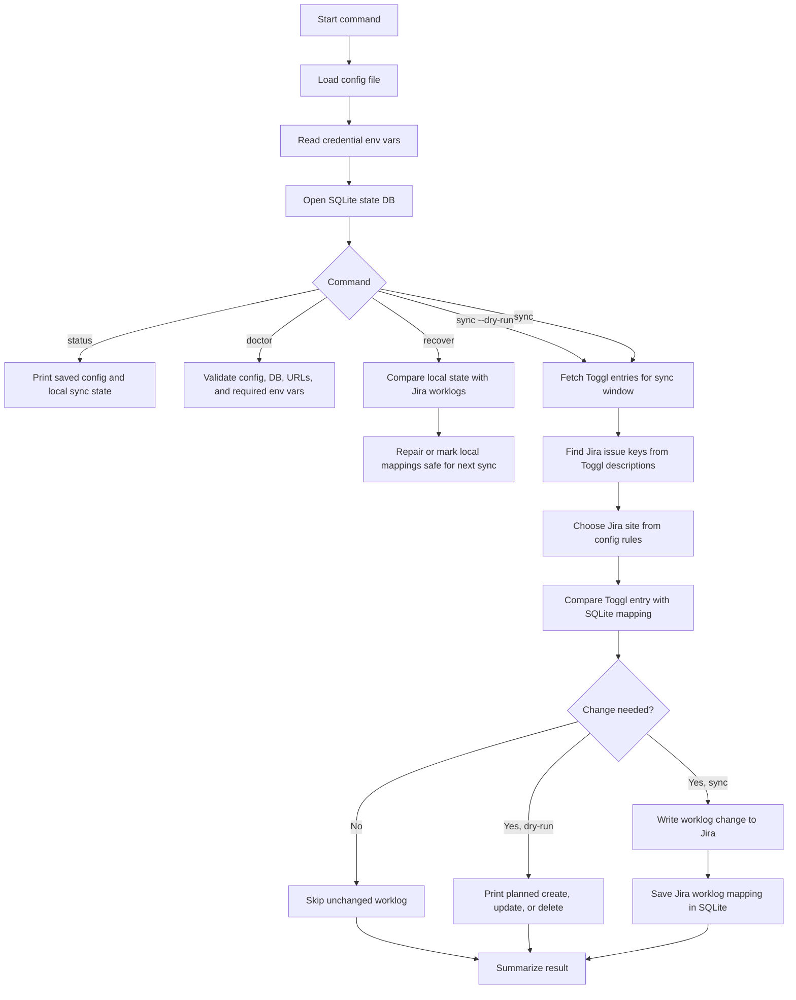

# Scheduling and safe setup for toggl-jira-sync

This app reads Toggl time entries, maps them to Jira issue keys, and writes Jira worklogs while tracking state in SQLite. Keep the config file and the DB on disk, but keep raw secrets local and gitignored.

> Security note: rotate any Toggl or Jira tokens that were pasted into chat, logs, tickets, or shared docs. Never commit raw credentials. Store token values only in your shell, launchd/cron environment, password manager, or a local gitignored credentials file.

## Quick setup

Use the short alias if you have it configured:

```sh
alias tjs=/usr/local/bin/toggl-jira-sync
```

Create or update config interactively, then inspect the saved, non-secret settings:

```sh
tjs config setup --config /Users/you/.config/toggl-jira-sync/config.toml --credentials /Users/you/.config/toggl-jira-sync/credentials.env
tjs config show --config /Users/you/.config/toggl-jira-sync/config.toml --credentials /Users/you/.config/toggl-jira-sync/credentials.env
```

The examples below use this state DB path: `--db /Users/you/Library/Application Support/toggl-jira-sync/state.sqlite`.

Check the current state before writing anything:

```sh
tjs status --config /Users/you/.config/toggl-jira-sync/config.toml --db /Users/you/Library/Application\ Support/toggl-jira-sync/state.sqlite
tjs doctor --config /Users/you/.config/toggl-jira-sync/config.toml --db /Users/you/Library/Application\ Support/toggl-jira-sync/state.sqlite
```

Run a dry-run first. It verifies the planned changes before sync writes are enabled.

```sh
tjs sync --dry-run --config /Users/you/.config/toggl-jira-sync/config.toml --db /Users/you/Library/Application\ Support/toggl-jira-sync/state.sqlite
```

Run the real sync only after the dry-run output looks right:

```sh
tjs sync --config /Users/you/.config/toggl-jira-sync/config.toml --db /Users/you/Library/Application\ Support/toggl-jira-sync/state.sqlite
```

If a run is interrupted or the local SQLite state looks stale, recover before the next scheduled sync:

```sh
tjs recover --config /Users/you/.config/toggl-jira-sync/config.toml --db /Users/you/Library/Application\ Support/toggl-jira-sync/state.sqlite
tjs status --config /Users/you/.config/toggl-jira-sync/config.toml --db /Users/you/Library/Application\ Support/toggl-jira-sync/state.sqlite
```

## Credentials

Use environment variable names in config, not token values. This per-site Sabservis example shows placeholders only:

```toml
# /Users/you/.config/toggl-jira-sync/config.toml
[toggl]
workspace_id = 123456
api_token_env = "TOGGL_API_TOKEN"

[runtime]
sqlite_path = "toggl-jira-sync.sqlite"

[schedule]
enabled = true
interval_minutes = 60

[jira]

[[jira.sites]]
key = "sabservis"
base_url = "https://sabservis.atlassian.net"
email_env = "SABSERVIS_JIRA_EMAIL"
api_token_env = "SABSERVIS_JIRA_API_TOKEN"
enabled = true
```

Keep raw values in a local file that is not committed:

```sh
# /Users/you/.config/toggl-jira-sync/credentials.env
# chmod 600 /Users/you/.config/toggl-jira-sync/credentials.env
export TOGGL_API_TOKEN="replace-with-your-toggl-token"
export SABSERVIS_JIRA_EMAIL="you@example.com"
export SABSERVIS_JIRA_API_TOKEN="replace-with-your-sabservis-jira-token"
```

Load it only in your local shell or scheduler environment:

```sh
set -a
. /Users/you/.config/toggl-jira-sync/credentials.env
set +a
```

## Sync algorithm



The sync path is intentionally conservative: dry-run prints the planned Jira writes, real sync records successful writes in SQLite, and recover exists for cases where a previous run was interrupted or local state needs to be reconciled.

## cron

Use absolute paths for the binary, config, DB, and log file because cron runs with a small environment.

```cron
TOGGL_API_TOKEN=replace-with-env-setup
SABSERVIS_JIRA_EMAIL=replace-with-env-setup
SABSERVIS_JIRA_API_TOKEN=replace-with-env-setup
BLOGIC_JIRA_EMAIL=replace-with-env-setup
BLOGIC_JIRA_API_TOKEN=replace-with-env-setup

*/15 * * * * /usr/local/bin/toggl-jira-sync sync --config /Users/you/.config/toggl-jira-sync/config.toml --db /Users/you/Library/Application\ Support/toggl-jira-sync/state.sqlite >> /Users/you/Library/Logs/toggl-jira-sync.log 2>&1
```

## macOS launchd

Save this as `/Users/you/Library/LaunchAgents/com.toggl-jira-sync.hourly.plist`, then load it with `launchctl load /Users/you/Library/LaunchAgents/com.toggl-jira-sync.hourly.plist`.

```xml
<?xml version="1.0" encoding="UTF-8"?>
<!DOCTYPE plist PUBLIC "-//Apple//DTD PLIST 1.0//EN" "http://www.apple.com/DTDs/PropertyList-1.0.dtd">
<plist version="1.0">
<dict>
  <key>Label</key>
  <string>com.toggl-jira-sync.hourly</string>
  <key>ProgramArguments</key>
  <array>
    <string>/usr/local/bin/toggl-jira-sync</string>
    <string>sync</string>
    <string>--config</string>
    <string>/Users/you/.config/toggl-jira-sync/config.toml</string>
    <string>--db</string>
    <string>/Users/you/Library/Application Support/toggl-jira-sync/state.sqlite</string>
  </array>
  <key>StartInterval</key>
  <integer>900</integer>
  <key>StandardOutPath</key>
  <string>/Users/you/Library/Logs/toggl-jira-sync.log</string>
  <key>StandardErrorPath</key>
  <string>/Users/you/Library/Logs/toggl-jira-sync.err.log</string>
  <key>EnvironmentVariables</key>
  <dict>
    <key>TOGGL_API_TOKEN</key>
    <string>replace-with-env-setup</string>
    <key>SABSERVIS_JIRA_EMAIL</key>
    <string>replace-with-env-setup</string>
    <key>SABSERVIS_JIRA_API_TOKEN</key>
    <string>replace-with-env-setup</string>
    <key>BLOGIC_JIRA_EMAIL</key>
    <string>replace-with-env-setup</string>
    <key>BLOGIC_JIRA_API_TOKEN</key>
    <string>replace-with-env-setup</string>
  </dict>
</dict>
</plist>
```

The sync command uses the SQLite lock table to reject overlapping runs. Keep one schedule per DB path and check logs for lock failures if a previous run is still active.
